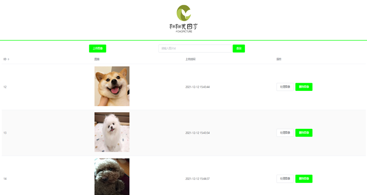
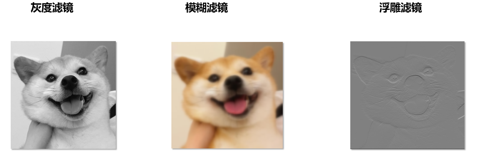

# qianduan

## Project setup
```
npm install
```

### Compiles and hot-reloads for development
```
npm run serve
```

### Compiles and minifies for production
```
npm run build
```

### 项目简介

+ 主页



+ 图像处理页


+ 滤镜效果




+ 旋转效果


